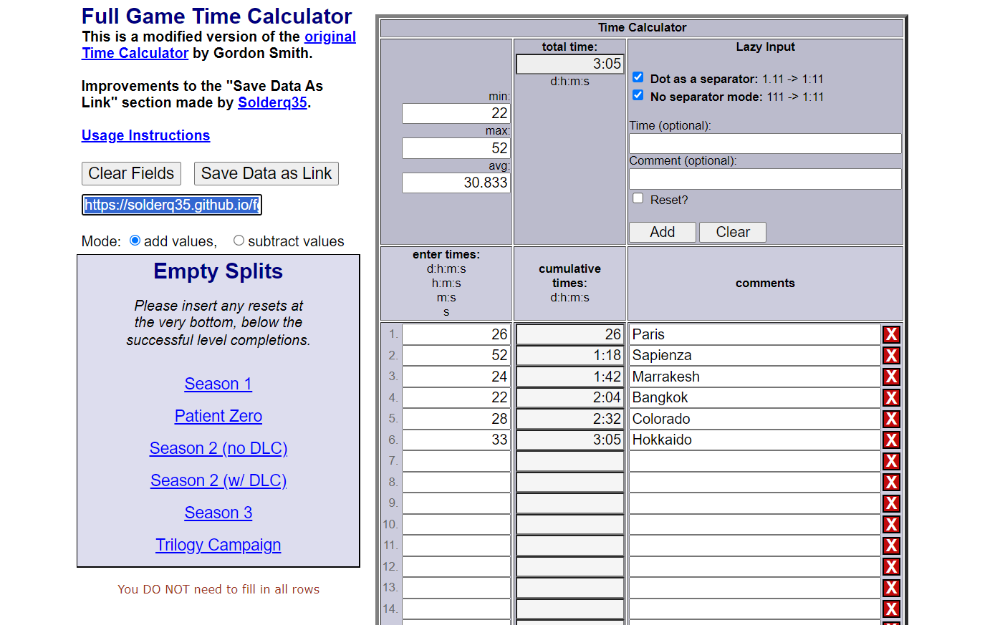
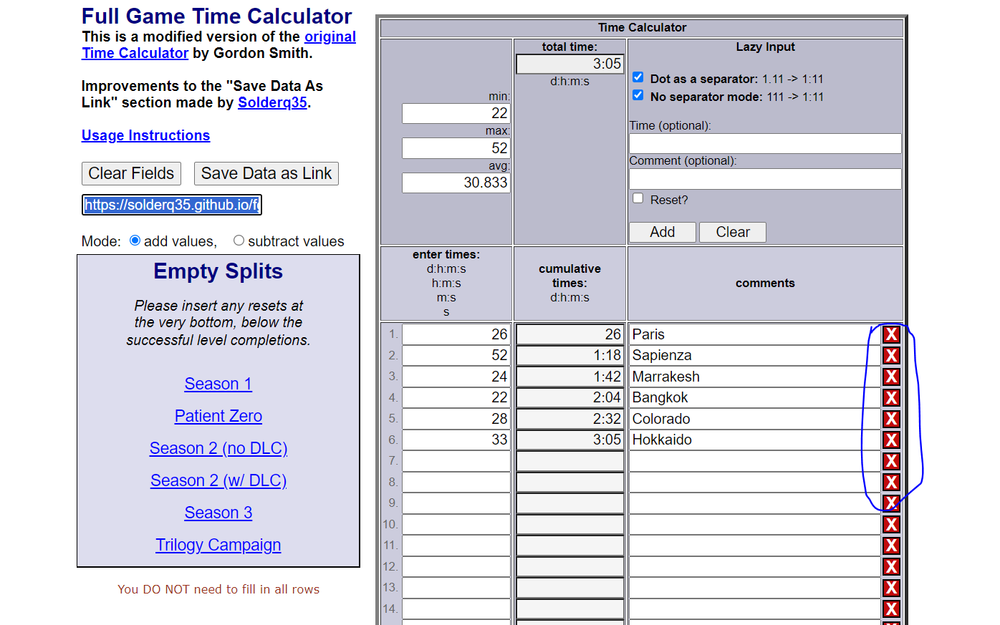
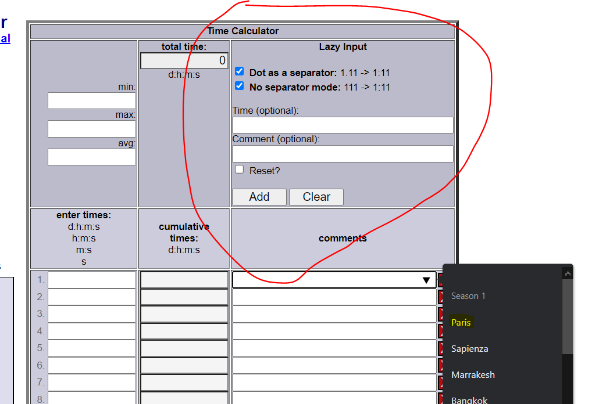
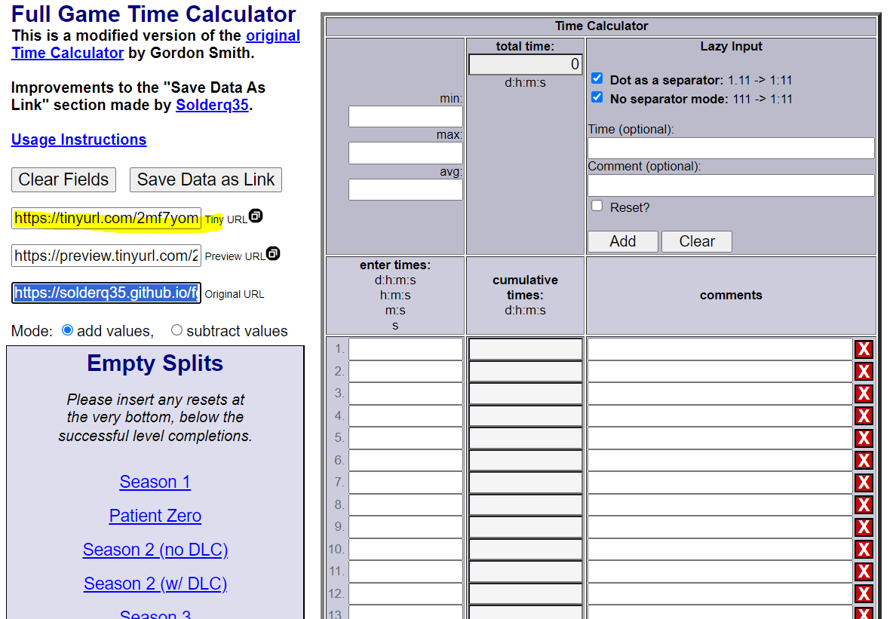

# Full Game Time Calculator

## Site URL (Try it Yourself!)

**https://solderq35.github.io/fg-time-calc/**

## About

### Background & Credits

The Full Game Time Calculator is a modified version of the [the original Time Calculator](https://www.grun1.grunsports.com/utils/timeCalc.html) by Gordon Smith.

- **NOTE: I obtained written permission from Smith to use and modify his source code as I wish, with the stipulation that my modified version remains free to use for everyone, and that I credit him and the original Time Calculator site appropiately, which I am happy to comply with**

I have to credit Smith for the idea of designing the calculator such that whatever you type into the calculator's rows is simply appended to the site's URL. This enables sharing simple timesplits and comments to others on the Internet without a need to deal with database costs or scaling.

In early 2021, I began looking into using Gordon Smith's site for the purpose of tracking [Hitman 3 Full Game speedruns](https://www.speedrun.com/hitman_3/full_game). In Hitman speedruns, for reasons of promoting cross-platform competition and fair play with different loading speeds, we simply sum up the in-game time level finishes for each level for the final time in a "full game run". However, while our policy resulted in better cross-platform compatibility in Hitman speedrunning, it also made it harder for people to tell at a glance how much time was spent on each level.

While conventional solutions to the problem of telling level completions at a glance exist such as [Livesplit](https://github.com/LiveSplit/LiveSplit), such solutions usually exclude console (e.g. Xbox and Playstation) players, as such consoles cannot have game memory read for level split timings like can be done on PC. So, we needed something different for the Hitman community to accomodate everyone on a fair playing field for all.

Considering the small but vibrant nature of Hitman speedrunning, with upwards of 1000 Hitman 3 full game speedruns as of April 2023, the no-datastore aspect of Smith's Time Calculator was a perfect solution to share the level split times of Hitman full game runs in perpetuity, to anyone on the Internet, at the click of a button, with no worries of cost scaling to boot.

However, there were still some improvements (in my humble opinion) to be made.

### My Improvements

**NOTE: I greatly appreciate Smith's contributions as noted above, and the following should only be read as constructive criticism / improvements**

Here are some of the improvements I have made to Smith's original Time Calculator (non-exaustive):

- Added feature to save URL with one click (on both desktop and mobile browsers); originally you had to manually highlight and copy the generated URL, which was especially unwieldy to work with on mobile
- Redeployed site on Github Pages, which lead to greater site stability
  - Github Pages deployment also enabled HTTPS protocol, which greatly improved the security of the application.
- Improved font size and readability
- Removed extraneous timing options that Hitman Speedrun community doesn't use
- Split code that was originally all on one HTML file into HTML, Javascript, CSS files to make the code more readable and maintainable

### Technologies Used

- Lightweight site built with Javascript, HTML, CSS.
- Deployed on Github Pages

## Screenshots and Usage Instructions

### Basic Usage

1. Enter times into input field, a running total of your total time is calculated. Use the format minutes:seconds for each level.
2. Click "Save Data as Link" (as highlighted in below screenshot); this will generate a run data output URL that will be copied to your clipboard automatically. As mentioned earlier, all the level times and level names will be saved in the output URL itself, enabling you to easily share your run stats with others.
3. Depending on how long your output URL is, you may want to use a link shortener service like https://tinyurl.com, https://cutt.ly, etc. so that your output URL takes up less text when sharing with your friends. Although this used to be supported by the Full Game Time Calculator natively via TinyURL API, this is no longer the case (see [Deprecation Notice](#deprecation-notice)).

Example Screenshot (Overview):

### Extra Features

There are some extra configuration options, such as:

- "Lazy Inputs" option, so that periods can also be used as minute and seconds separators, or even infer minutes vs seconds based on digits of the input without any separators needed.
- Input for custom time and comment insertions, speeds up workflow for recurring comment fields (like when you got several reset splits in a row)
- Dropdown menu for level names to save time spent typing them
- "X" buttons to automate deleting entire comment fields

Screenshots:

### Deprecation Notice

- This used to feature a build-in link shortener via TinyURL API, but that is no longer the case due to financial reasons
- **The build-in link shortener may return in the future** via a cheaper vendor / self-hosting (no promises, PR's welcome in the meantime)
  
